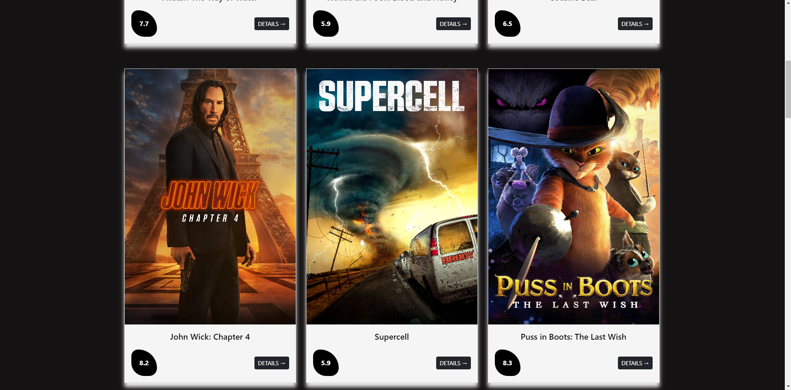
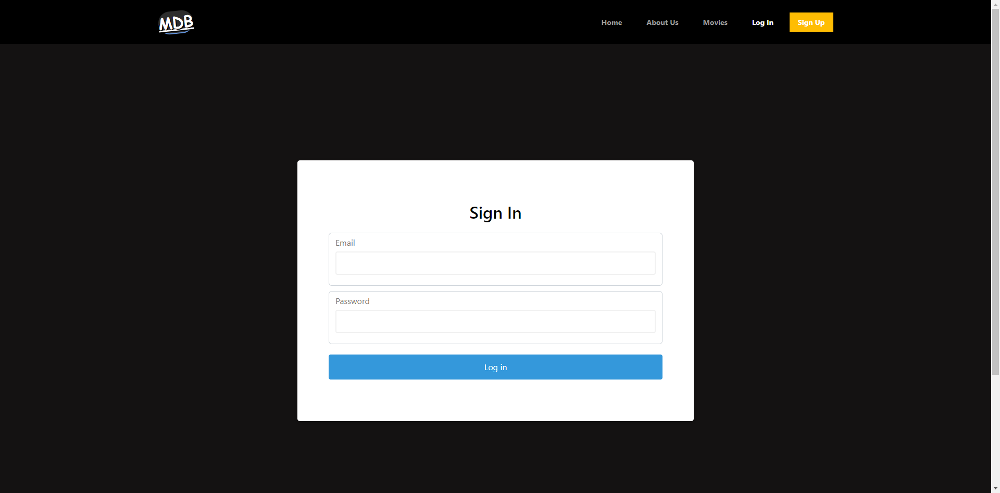

# Movie Website with React.js

## Description

Here is a project by working API in it and showing current popular movies on  UI.  

## Features

- React
- Bootstrap
- React-router-dom
- Using Movie DB Api and fetch data by axios.
- Using React Formik for Validations
- Login-Register

## Installiation
- git clone https://github.com/bilalgokburi/movies-website
1. npm update 
2. npm start

## Project Screen Shot(s)

